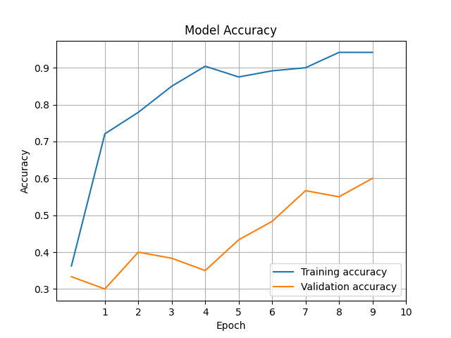

# AI-road-signs
AI that will decide which road sign is provided

Put your images in directory "images"

Use commands:

```
run main.py
<input createmodel to learn the model>
<input createmodel several times
 if you are not satisfied with validation accuracy>
<input predict to execute prediction to all images>
```

Test signs output:


My learning results:


